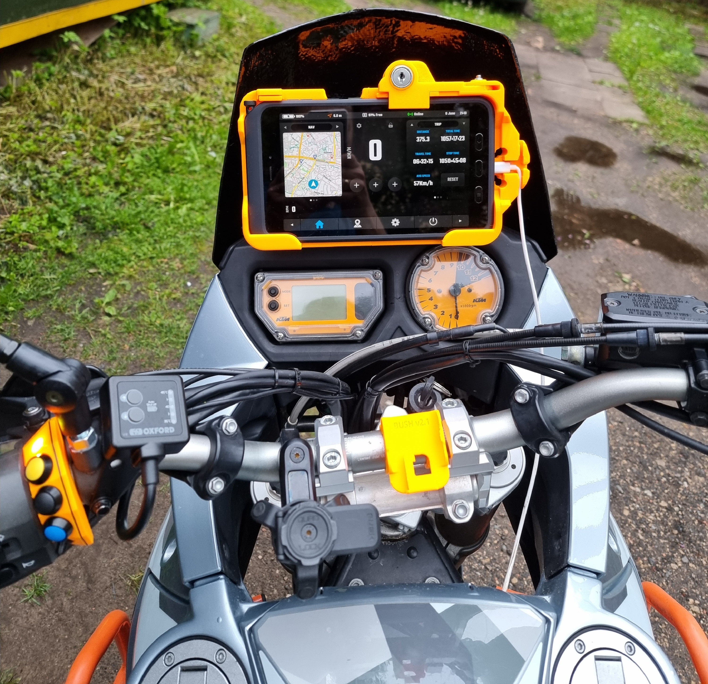
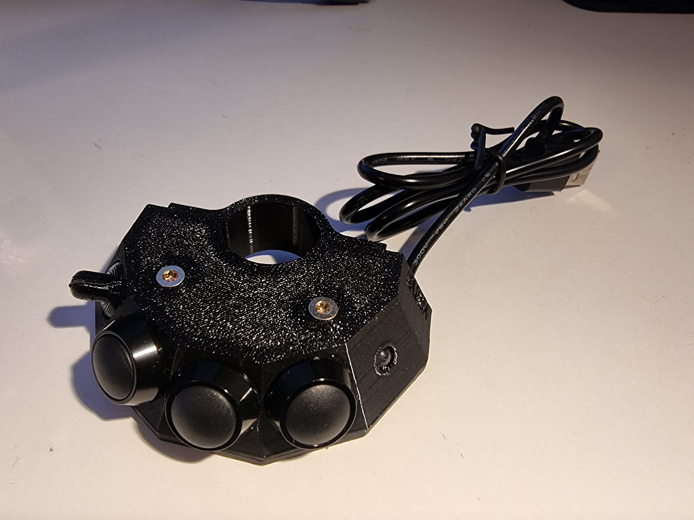
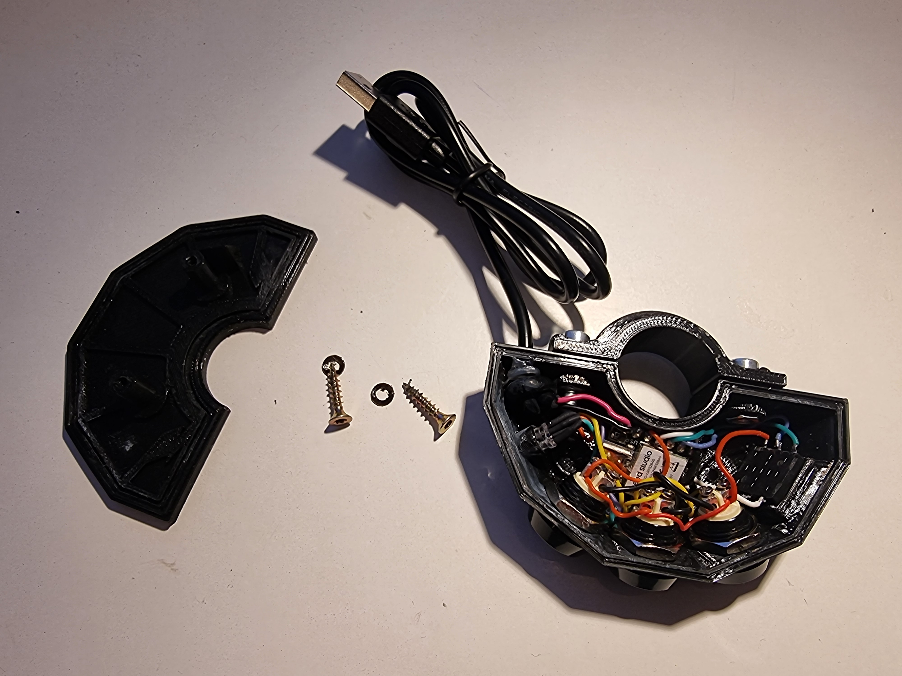
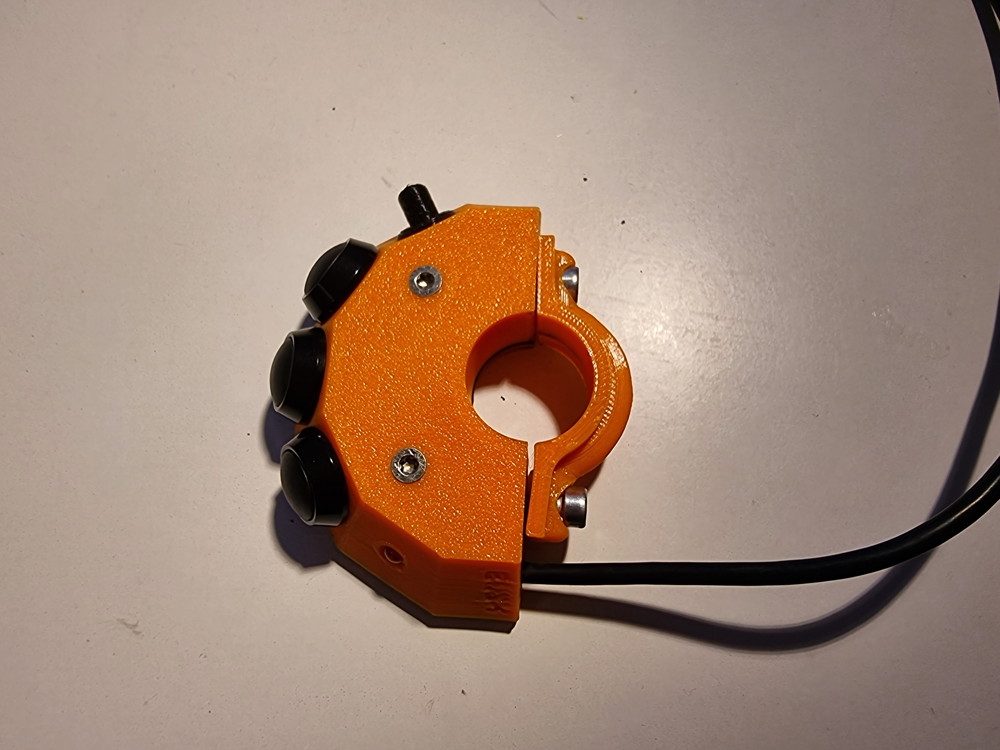
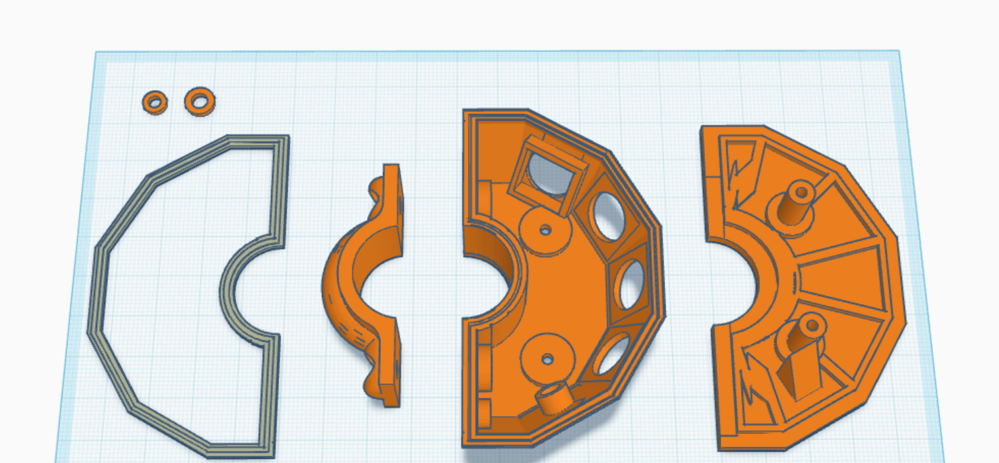
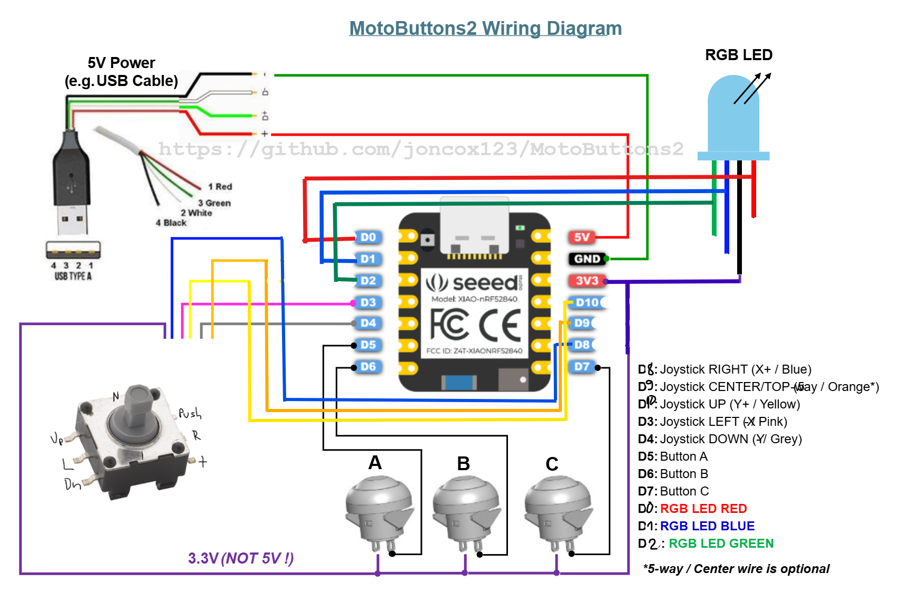

# Bush's Moto Buttons v1.0
### Thanks to [the original author](https://github.com/joncox123/MotoButtons2/tree/main) for free sourcing this amazing piece of art, especially the dev board wiring and the code part! So, I needed some modifications to it to move forward to perfection. To continue supporting enduro, offroad, adventure enthusiasts who can also tinker with electronics, and build a relatively inexpensive alternative to moto buttons, I also want to share my work.

### My changes:
- LED brightness control by holding the A key
- Added possibility to add any color or brightness (within code)
- Separate key A and Joystick Center key codes (in original code they were the same)
- DMD2 mode color changed to blue (looks cooler)
- Button special function changes (will be described later)
- Added reset option by holding A,B,C keys. This is a workaround for the issue when Bluetooth auto-pairing did not work anymore, e.g., when the moto buttons are powered on, auto-connection to the phone/tablet does not work

### Design:

| | |
| --- | --- |
|  |  |
|  |  |

### Parts:
- Some old USB-A cable for power and other wires
- Seeed Studio XIAO nRF52840 series (I used Seeed Studio XIAO nRF52840 Sense)
- 3x waterproof buttons (I used V12B-10N-A)
- 5-way joystick (I used JS5208)
- RGB LED common **anode ONLY** (I used OSTAMA5B31A) **Do not use common cathode, I already burned 2x Seeed boards to realize that**
- 3D printed case with some screws (the case is waterproof enough to hold rain and some submersion. I've already been using it for 1 year, no issues. But use some super glue on the TPU gasket and glue gun around holes from inside). All TPU and PETG (or alternative filament) STLs are in 3D folder.

## User Manual
The device has:
- 3x buttons and 1x joystick as inputs
- 1x LED indicator (for understanding what is going on)

Standard button functionality by mode:

`DMD2` mode (**NOTE**: bound buttons manually in Settings -> Setup Remote Controller):
- Button A short press or hold - `F6` / oom in
- Button B short press or hold - `F7` / zoom out
- Button C short press or hold - `Enter` / follow toggle (focus)
- Joystick Up, Down, Left, Right - Arrow keys
- Joystick Middle press - `F8`

`OsmAnd` mode:
- Button A short press or hold - `+` / zoom in
- Button B short press or hold - `-` / zoom out
- Button C short press or hold - `C` / move to my location (focus)
- Joystick Up, Down, Left, Right - Arrow keys
- Joystick Middle press - Unbound

`Media` mode:
- Button A short press or hold - Play / Pause
- Button B short press or hold - Screen brightness up
- Button C short press or hold - Screen brightness down
- Joystick Up - Volume up
- Joystick Down - Volume down
- Joystick Left - Previous track
- Joystick Right - Next track
- Joystick Middle press - Mute

Special functions:
- Hold joystick up button when powering on device, it will select correct orientation
- Button A+B long press - LED brightness changes; hold it until you are satisfied and release
- Button B+C long press - Mode change: DMD2 (blue) -> OsmAnd (green) -> Media (magenta)
- Button A+B+C long press (5 secs) - Erase FS. This is a workaround to get BT auto-connect working again
- Button A+C long press (5 secs) - Enter DFU mode (for programming)

## Wiring
If something is unclear, please read [the original author's manuals](https://github.com/joncox123/MotoButtons2/tree/main/ConstructionGuide).

## Code
Please read [the original author's manuals](https://github.com/joncox123/MotoButtons2/tree/main/Programming) on how to do that.
