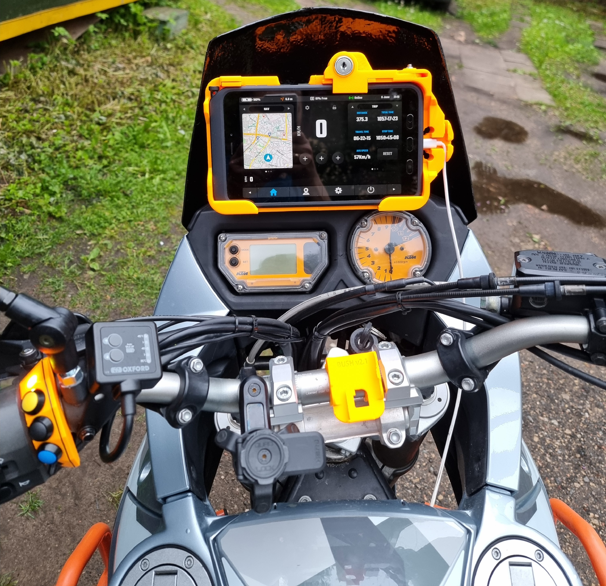
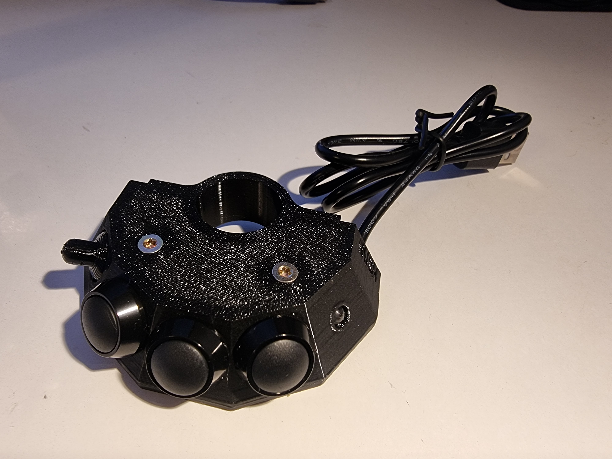
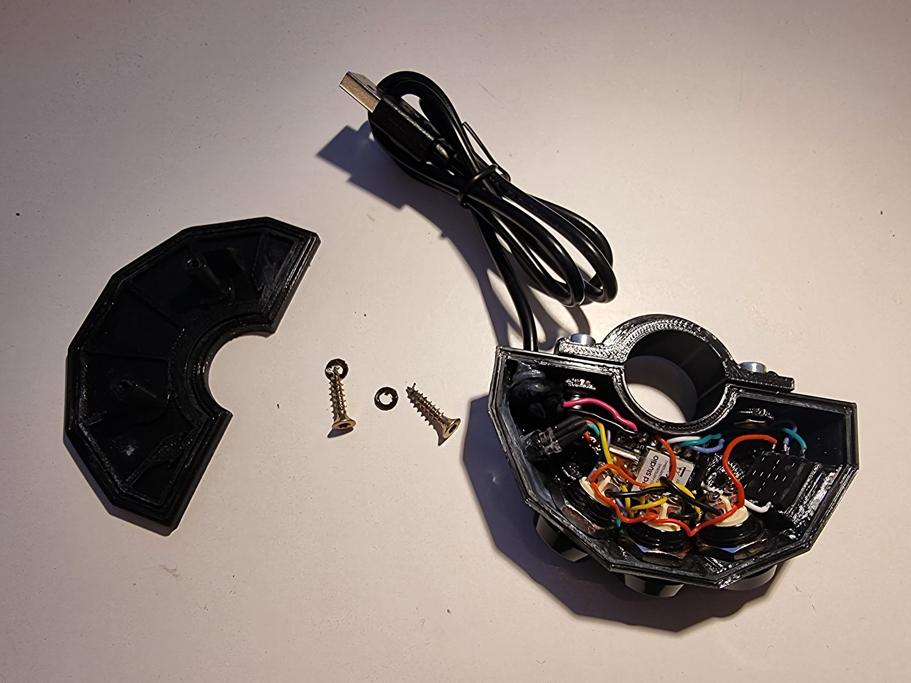
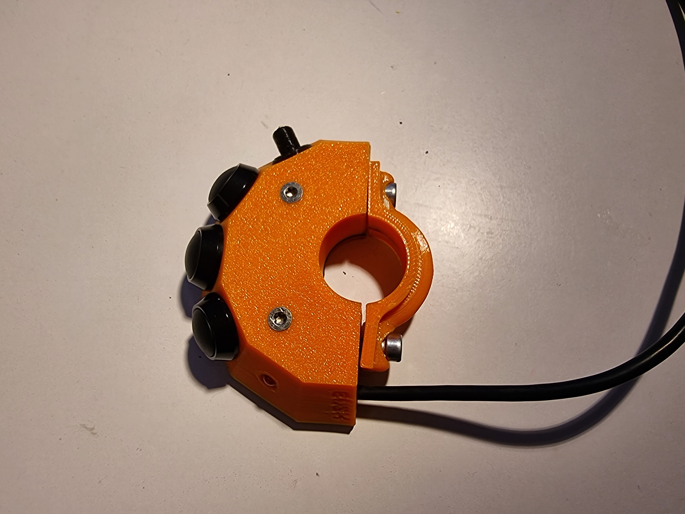
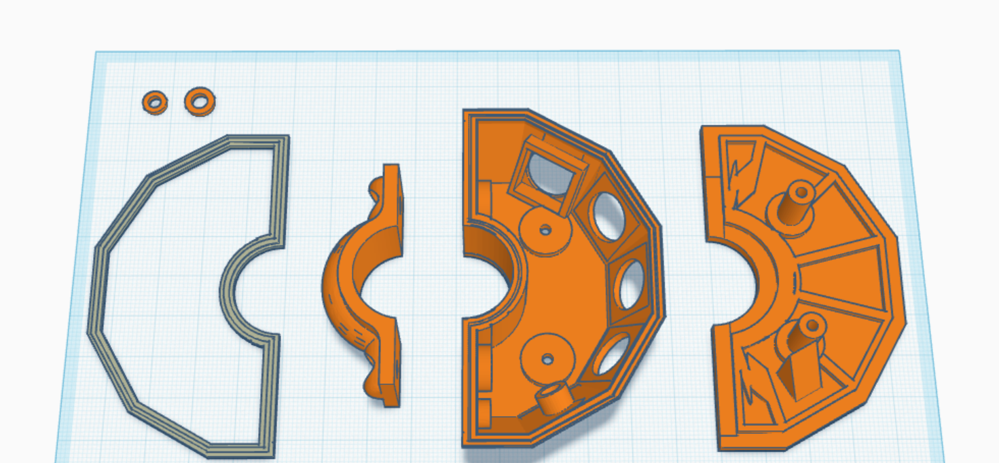
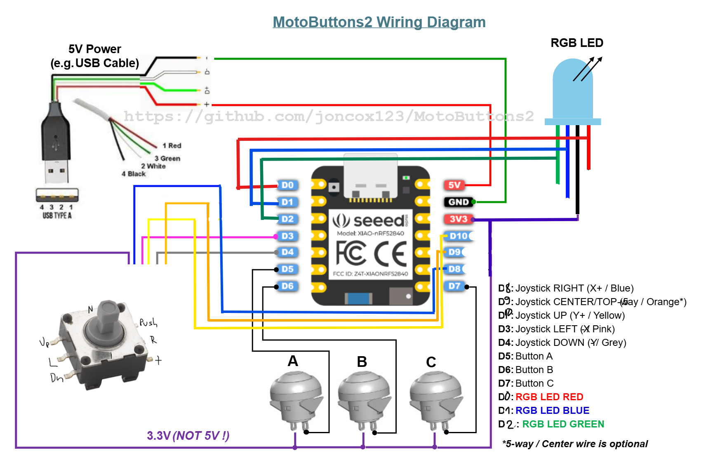

# Bush's Moto Buttons v2.1
### Thanks to [the original author](https://github.com/joncox123/MotoButtons2/tree/main) for free sourcing this amazing piece of art, especially the dev board wiring and the code part! So, I needed some modifications to it to move forward to perfection. To continue supporting enduro, offroad, adventure enthusiasts who can also tinker with electronics, and build a relatively inexpensive alternative to moto buttons, I also want to share my work.

A handlebar Bluetooth controller for motorcycle navigation. An **ESP32-C3 OLED Mini** board with a
5-way joystick and three buttons presents itself as a Bluetooth keyboard and drives DMD2, OsmAnd, Locus
Map or a media player, showing what it is doing on the board's 72x40 OLED.

### My changes against the original
- Runs on the ESP32-C3 OLED Mini instead of the nRF52840. The onboard OLED replaces the RGB LED as
  the indicator and shows the mode, the connection state and which inputs are pressed
- Separate key codes for button A and the joystick centre (they were the same in the original)
- DMD2 mode sends raw key down / key up, so DMD2 does its own key repeat and long press
- The joystick lines are measured with the ADC instead of read digitally, which keeps a leaky
  joystick pod usable ([why](Docs/joystick-input-notes.md))
- Button chords for mode change, display on/off, restart and factory reset, with an on-screen
  countdown for the long ones
- Joystick orientation chosen by holding a direction right after power-on, for four mounting positions
- Once a phone has paired, only bonded phones are accepted for a while after each power-on
- Watchdog, versioned settings, and dimming and blanking to spare the OLED

### Design:

| | |
| --- | --- |
|  |  |
|  |  |

### Parts:
- Some old USB-A cable for power and other wires
- ESP32-C3 OLED Mini (an ESP32-C3 with a 0.42" 72x40 SSD1306 OLED on board)
- 3x waterproof buttons (I used V12B-10N-A)
- 5-way joystick (I used JS5208)
- 3D printed case with some screws (the case is waterproof enough to hold rain and some submersion. I've already been using it for 1 year, no issues. But use some super glue on the TPU gasket and glue gun around holes from inside). All TPU and PETG (or alternative filament) STLs are in 3D folder.



## User Manual
The device has:
- 3x buttons (A, B, C) and 1x 5-way joystick as inputs
- the onboard 72x40 OLED and one status LED as indicators

### Modes
Hold **B+C** for one second to step through the modes: DMD2 -> OsmAnd -> Locus -> Media -> DMD2. The mode is
remembered across power cycles.

`DMD2` mode - raw key down on press and key up on release for every input; DMD2 handles repeat and
long press itself (see the [controller implementation guide](Docs/dmd2-controller-implementation-guide.md)):
- Button A - `F6` / zoom in
- Button B - `F7` / zoom out
- Button C - `Enter` / follow toggle (focus)
- Joystick Up, Down, Left, Right - arrow keys
- Joystick centre - `F5`

`OsmAnd` mode - the firmware repeats keys while they are held:
- Button A - `+` / zoom in (repeats)
- Button B - `-` / zoom out (repeats)
- Button C - `C` / move to my location (once per press)
- Joystick Up, Down, Left, Right - move the map. While held, the arrow is tapped (30 ms down, 30 ms
  up) so that OsmAnd adds its 200 px nudge on every tap on top of its own slow scroll. Tune
  `OSMAND_DIRECTION_KEY_DOWN_MS` and `OSMAND_DIRECTION_KEY_UP_MS` in config.h; keep both at or above
  the Bluetooth connection interval, which the serial log shows at connect
- Joystick centre - unbound

`Locus` mode - for [Locus Map](https://play.google.com/store/apps/details?id=menion.android.locus). In
Locus, enable **Settings > Controlling > Use hardware buttons**; the pan distance per press is
**Map movement step** in the expert settings:
- Button A - volume up / zoom in (repeats). Locus zooms in only on `KEYCODE_PLUS` or volume up, and
  a Bluetooth keyboard cannot send `KEYCODE_PLUS`
- Button B - `-` / zoom out (repeats)
- Button C - `C` / follow my position on/off (held while pressed). Locus moves the map on the next
  GPS fix: at once with a good fix, a few seconds with a weak signal; pressing again turns following off
- Joystick Up, Down, Left, Right - arrow keys, raw key down / key up as in DMD2; Locus moves the map
- Joystick centre - unbound

`Media` mode - media keys:
- Button A - play / pause (once per press)
- Button B - screen brightness up (repeats)
- Button C - screen brightness down (repeats)
- Joystick Up / Down - volume up / down (repeat while held)
- Joystick Left / Right - previous / next track (once per press)
- Joystick centre - mute (once per press)

The Bluetooth name is set by `BLE_DEVICE_NAME` in [config.h](ArduinoCode/MotoButtons2/config.h) and
is currently `DMD-Remote3`, so that DMD2 takes the controller as a DMD Remote 3 (see below). After a
name change, forget the controller on the phone and pair it again.

The controller presents itself as a generic HID device that has only the keys the modes use, not as a
full keyboard, so the phone's on-screen keyboard still appears when you tap a text field. After a
firmware update that changes this, forget the controller on the phone and pair it again.

### DMD2 and the DMD Manage app
DMD2 accepts plain Bluetooth keys only as its paid *Generic Remote Controller*. Its *DMD Remote* slots
are fed by THORK Racing's **DMD Manage** app instead: its accessibility service takes the keys of a
device whose name contains `DMD-Remote3` and hands them to DMD2 as Remote 3. So DMD Manage must stay
installed; without it DMD2 ignores the controller unless the Generic licence is active.

DMD Manage belongs to THORK Racing and is not part of this repository. Download it from their
[Manage App page](https://docs.dmdnavigation.com/otherapps/manage-app/) (tested: version 3.06,
`DMD_Manage_v3_06.apk`, SHA-256 `1e0e469bc905de8e6eabf3d10b48e6cbe32b64e87b900b0c1133acd491992188`).

The easiest way is the [Moto Buttons Tool](#moto-buttons-tool-windows) (*Install DMD support*): it
downloads DMD Manage, installs it over USB and switches everything on. Installing from the phone itself
is blocked by Google Play Protect (on Samsung it ends in "App not installed"); `adb install` skips that
check.

By hand instead:
1. On the phone enable *Developer options* -> *USB debugging* and connect it by USB; allow the PC when
   asked. Run `adb install DMD_Manage_v3_06.apk` (`adb` comes with Android SDK Platform Tools).
2. Open DMD Manage and switch on its **Accessibility** service. The *Display over other apps* request is
   for the BMW controller overlay and can be skipped.
3. Pair the controller (`DMD-Remote3`) and press any button on the Controller Detection screen; it shows
   *DMD Remote3*.
4. Set DMD Manage's battery use to *Unrestricted* so Samsung does not freeze it.

Either way, then:
1. In DMD2 add the device as **Remote 3** and assign each function by pressing the button - Remote 3
   starts with an empty map. *Back / Locations* returns to your position after panning (*Map Follow
   Toggle* opens the point menu instead). Double tap works only on the keys set as *Long Press - Remote
   Menu* (Button 1) or *Long Press - Cancel* (Button 2).

DMD Manage does not update itself; install new versions the same way.

### Updating from the phone (no PC)
Open **https://aivisbush.github.io/AdvMotoButtons/** in Chrome on the phone the controller is paired
with. The page walks through three steps:
1. **Install the app** - download `moto-buttons.apk` and install it (Android asks to allow Chrome to
   install apps; if Play Protect warns, *More details* > *Install anyway*).
2. **DMD2 support** (optional) - a link to THORK Racing's DMD Manage page; the app then guides the
   Accessibility and *Allow restricted settings* steps.
3. **Open Moto Buttons** - the app finds the controller, compares its firmware with the latest release
   on the site and offers *Update*. When it says **All set**, *Remove this app* uninstalls it again
   (DMD Manage stays).

The controller needs firmware 2.2.0 or newer for Bluetooth updates; older ones are flashed once by USB.
The app tells the boards apart (ESP32-C3 OLED, ESP32-C3, ESP32-C6, nRF52840) by the product ID in the
controller's Bluetooth PnP ID and only offers that board's firmware. Its menu has **Beta firmware** to
also offer newer beta releases.

### Publishing releases
The site is the `gh-pages` branch (Settings > Pages > Deploy from a branch > `gh-pages` / root). A tag
on a board's branch builds, checks and publishes that board's firmware
([release.yml](.github/workflows/release.yml)):

| Tag | Publishes |
|---|---|
| `esp32c3-oled/v2.4.1` | production firmware 2.4.1 for the ESP32-C3 OLED board |
| `esp32c3-oled/v2.4.2-beta.1` | beta firmware; the app offers it only with *Beta firmware* on |
| `app/v1.4` | the Android app (`moto-buttons.apk`) |

1. Set the version in [config.h](ArduinoCode/MotoButtons2/config.h) (`FIRMWARE_VERSION_TAG`, e.g.
   `MBFWVER=2.4.1` or `MBFWVER=2.4.2-beta.1`), commit and push the branch.
2. Tag and push: `git tag esp32c3-oled/v2.4.1` then `git push origin esp32c3-oled/v2.4.1`.
3. The workflow builds with the branch's `release.json` (board, sketch, arduino-cli profile), refuses
   a tag that does not match the version and board inside the `.bin`, adds it to `gh-pages`
   (`firmware/<board>/<prod|beta>/`, `firmware/latest.json`) and creates a GitHub Release.

Each board's branch needs its own `release.json` and `BOARD_ID_TAG` / `BOARD_PRODUCT_ID` in `config.h`
(esp32c3-oled 0x4001, esp32c3 0x4002, esp32c6 0x4003, nrf52840 0x4004), plus the Bluetooth update
service (`ota.cpp`). For `app/` tags the repository needs two secrets (Settings > Secrets and variables >
Actions): `ANDROID_KEYSTORE_BASE64` (the release key, `base64 -w0 release.jks`) and
`ANDROID_KEYSTORE_PASSWORD`. Locally, `site/tools/publish.py --site <gh-pages checkout> --firmware <bin>
--channel prod|beta` does the same by hand. Keep the signing key (`%USERPROFILE%\.motobuttons\`) backed
up: app updates must be signed with the same key.

### Moto Buttons Tool (Windows)
A single portable `MotoButtonsTool.exe` (no install; Windows 10/11) that sets up a phone over USB and
updates the controller's firmware. Build it with `Apps\Windows\build.ps1` after building the Android
app (`Apps\Android`: `gradlew assembleDebug`). On first use it downloads Google's platform tools (adb)
into a `MotoButtonsTool_data` folder next to the exe.

Connect the phone by USB with USB debugging on, allow the PC, then go through the steps:
1. **Check phone** - finds the phone and shows what is installed.
2. **Install DMD support** - downloads DMD Manage from THORK Racing, installs it and turns on its
   accessibility service and background use. No taps on the phone needed.
3. **Pair the controller** - opens Bluetooth settings on the phone: tap *Scan*, tap `DMD-Remote3`, tap
   *Pair*. Press the button again to check. Unpair first if the controller was paired before a firmware
   that added a Bluetooth service.
4. **Install Moto Buttons app** - the phone app that sends firmware to the controller.
5. **Controller firmware** - choose the firmware `.bin` (the app image `MotoButtons2.ino.bin`, not the
   merged one). It is copied to the phone and the Moto Buttons app opens: check the controller is
   selected, tap *Update firmware* and confirm. About 90 s; the controller restarts and reconnects.

The phone app can also update from any `.bin` saved on the phone (*Choose firmware file*). It lists
only paired controllers that have the Moto Buttons update service, with their firmware version. The
first firmware with the update service (2.2.0) has to be flashed by USB once, and every phone must
then forget and re-pair the controller.

### Button chords
| Buttons | Hold | Action |
|---|---|---|
| B + C | 1 s | Next mode |
| A + B | 1 s | Display on / off |
| A + C | 5 s | Restart the controller (countdown on screen) |
| A + B + C | 5 s | Factory reset: settings and Bluetooth bonds (countdown on screen) |

While two or three buttons are held, none of them is sent as a key. A lone A, B or C press is sent
about 50 ms after it is registered, so a chord pressed as one movement never leaks a key to the
phone; a chord pressed one finger after the other may still send the first key briefly.

### Joystick orientation
The controller can be mounted in four positions. During the first 2.5 seconds after power-on, while
the boot screen is showing, hold the joystick in the direction that should be UP for about half a
second. The display confirms with `Orientation is set, UP is ...` and the choice is saved. Without a
held direction the saved orientation is kept.

Press the direction *after* power is on rather than holding it while switching on: joystick RIGHT
and button B sit on chip strapping pins, and the board will not boot normally with either held.

### Screens
1. `Booting` with the firmware version
2. `Orientation is set` if a direction was held
3. `Connecting` until a phone connects
4. `Connected`, then a `READY TO >> RACE` splash, once per power-on
5. The mode screen: the mode name plus a button overlay along the top. Each input has a fixed slot -
   `A B C`, the four directions as arrows, centre as a dot - and a slot is drawn only while that
   input is held. The arrows show the orientation-mapped directions.

The display dims after 30 seconds without a press or connection change and switches off after a
minute with no phone connected. Any press, or a phone connecting, wakes it.

### Status LED
Breathes while waiting for a phone, glows dimly once connected.

### Bluetooth pairing
The controller bonds with "Just Works" pairing; there is no PIN. Pair from the phone's Bluetooth
settings while the display shows `Connecting`. From then on the controller reconnects on its own.

Once a phone has bonded, the controller advertises to bonded phones only for the first 90 seconds
after power-on and after every disconnect, so a stranger's phone cannot grab it at a fuel stop. After
that it opens up until the next disconnect, so a phone that lost its bond can pair again. To pair an
additional phone, either wait for that open window or do a factory reset (A+B+C for 5 s) and pair
everything again. If a phone refuses to connect after a factory reset, forget the controller on the
phone and pair afresh.

## Wiring
GPIO numbers, not Arduino `D` aliases. All button commons go to GND.

```
GPIO0  joystick UP        GPIO5  OLED SDA        GPIO9  button B   (strapping)
GPIO1  joystick CENTER    GPIO6  OLED SCL        GPIO10 button C
GPIO2  joystick RIGHT     GPIO7  button A        GPIO20 RX, free
GPIO3  joystick DOWN      GPIO8  status LED      GPIO21 TX, free
GPIO4  joystick LEFT             (strapping)
```

If something is unclear, please read [the original author's manuals](https://github.com/joncox123/MotoButtons2/tree/main/ConstructionGuide).
The diagram below is still the original nRF52840 drawing, hand-annotated for the C3 pins above.



## Code
See the [programming instructions](Programming/README.md). The sketch is split into units; every
tunable (pins, timings, key codes, Bluetooth name, debug switches) is in
[config.h](ArduinoCode/MotoButtons2/config.h), and the key tables are in
[keymap.cpp](ArduinoCode/MotoButtons2/keymap.cpp). Firmware updates over Bluetooth are in
[ota.cpp](ArduinoCode/MotoButtons2/ota.cpp); the phone app is in [Apps/Android](Apps/Android) and the
Windows tool in [Apps/Windows](Apps/Windows).

## References
- https://github.com/sigmdel/mini_esp32c3_oled_sketches
- [DMD2 controller implementation guide](Docs/dmd2-controller-implementation-guide.md) - archived copy of the
  DMD Navigation page describing how DMD2 recognises a controller by its Bluetooth name, and the key codes for
  each button scheme ([original](https://www.drivemodedashboard.com/controller-implementation-guide/), now offline;
  [archived snapshot](https://web.archive.org/web/20250121205014/https://www.drivemodedashboard.com/controller-implementation-guide/))
- https://github.com/StylesRallyIndustries/RallyController - another DIY DMD2 controller; its changelog confirms
  the `DMD2 CTL xK` device names are what DMD2 detects

## Notes
Background notes for anyone (or any agent) picking this up:
- [CLAUDE.md](CLAUDE.md) - project overview, pin map, build notes and design decisions
- [Docs/joystick-input-notes.md](Docs/joystick-input-notes.md) - why the joystick is read with the ADC
- [Docs/dmd2-recognition-notes.md](Docs/dmd2-recognition-notes.md) - state of the DMD2 remote recognition work
